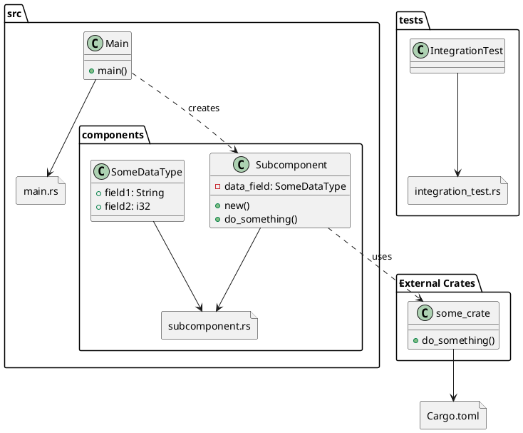

# Copilot Instructions

- Use extreme brevity at all times.

# Project Definition

This is a Model Context Protocol server.

- Rust is the primary programming language.
- Use Rust Model Context Protocol (MCP) SDK. https://github.com/modelcontextprotocol/rust-sdk
- Use HTTP/SSE transport for MCP.

- Include these components
  - Main: "main.rs"
  - MCPServer: "lib.rs"
  - handlers/PromptHandler
  - handlers/ToolHandler
    - Echo tool.
  - handlers/ResourceHandler
  - Dummy implementation.
  - tests/IntegrationTest
    - Query for available tools.

# Code Implementation Guidelines

When writing code, focus on minimal functional implementations:

- Write only the essential code needed for a working solution.
- Avoid unnecessary error handling, logging, or defensive programming.
- Skip comprehensive testing, validation, documentation, or edge case handling.
- Prioritize simplicity.
- Prioritize separation of concerns.
- Reduce amount of code to the bare minimum required for functionality.

# Resources

MCP Documentation

- https://modelcontextprotocol.io/specification/2025-06-18

# Phases

## Phase 1: Planning

- Review Resources.
- Create a PlantUML Diagram in `architecture.puml`.
- Include public classes, methods, constants, and their relationships.
- Include class data fields.
- Include input and output types for methods.
- Exclude &self from method signatures.
- Exclude Result/Error wrappers from method signatures.
- Include dependencies on external libraries.
- Include definitions for any custom types.
- Include the files custom types are defined in.
- Place Custom Types in the same package as the file that defines them.
- Include links between all classes and the files they are defined in.
- Include links for relations like "creates", "uses", "delegates", or "calls".
- Exclude links for relations like "returns" , "references type".
- Example PlantUML Diagram:

## Phase 2: Implementation

- Implement the project structure as defined in the `architecture.puml`.
